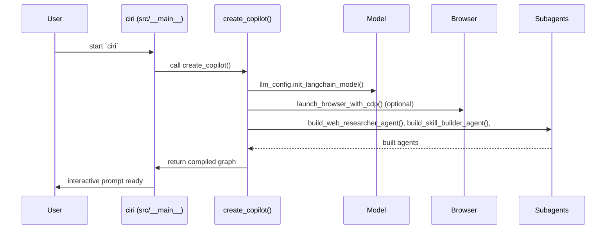
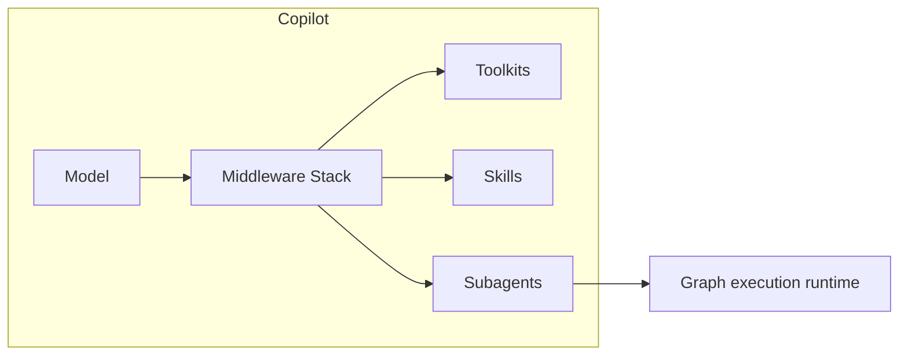
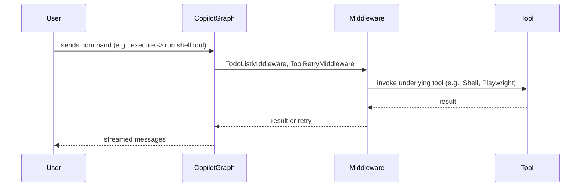

# Architecture - Components (Deep Dive)

This page documents the major components and their interactions with concrete references to the implementation in this repository.

Key files to inspect in the source tree:

- Entry & CLI loop: `src/__main__.py`
- Copilot orchestration and agent builders: `src/copilot.py`
- Controller & graph execution: `src/controller.py`
- Utilities (skill discovery, env, filesystem): `src/utils.py`
- Skills, toolkits, subagents folders: `src/skills/`, `src/toolkit/`, `src/subagents/`

Design overview

- The CLI boots via `src.__main__:main` (console script `ciri`) which loads env, settings, and constructs a Copilot graph using `create_copilot()` in `src/copilot.py`.
- `create_copilot()` initializes the LLM, launches or connects to a browser CDP endpoint (if available), builds shared subagents (web researcher, skill/toolkit/subagent/trainer builders), pre-configures middleware (toolkits, skills), then compiles and returns a LangGraph state graph used by the controller.

Mermaid: high-level boot sequence (CLI → create_copilot → subagents)

Middleware & Execution stack

- The Copilot populates a middleware stack used by subagents and the graph. Middlewares include `ToolRetryMiddleware`, `TodoListMiddleware`, `ToolkitInjectionMiddleware`, `SkillsMiddleware`, and other deepagents-provided middlewares like `FilesystemMiddleware`.
- Middlewares are instantiated in `create_copilot()` and passed to agent builders. This allows each agent to have transparent access to skills and toolkit APIs.

Component responsibilities (short)

- src/__main__.py — CLI loop, PromptToolkit integration, completers (see `CiriCompleter` class for @skills:, @files: triggers), environment persistence helpers (e.g., `_persist_env_var`) and API key prompting (`ensure_openrouter_api_key`).
- src/copilot.py — build orchestration for the LangGraph-based copilot. Look at `create_copilot()` to trace how model, browser, middleware, and subagents are initialized and combined.
- src/controller.py — controller wrapper around the compiled graph, exposing `run()`, `get_state()`, and thread management (create, list, delete threads) that connect to `src/db.py`.
- src/utils.py — wide set of utilities: app data dirs, .env loading, browser profile copying, file listing with .gitignore awareness, and fetching models from OpenRouter.

Mermaid: middleware & call-flow for a tool execution

Developer notes & pointers

- If you want to modify the agent build or add custom middleware, edit `src/copilot.py:create_copilot()` where the model is initialized and subagent builders are awaited.
- To inspect how messages and streamed chunks are serialized for UI, review `src/controller.py` and `src/serializers.py`.
- For autocomplete triggers and filesystem-aware completion, inspect `CiriCompleter` in `src/__main__.py` (see `list_files_with_gitignore()` references in `src/utils.py`).

This page is intentionally developer-focused — for real-world usage scenarios and sequence diagrams see the Use Cases page.
