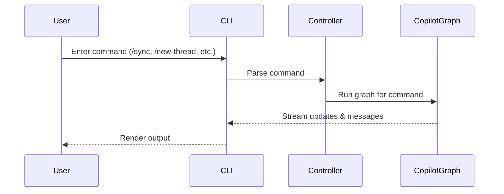

# CLI Reference

This section documents top-level commands and common prompt commands.

Top-level usage:

- Entrypoint: ciri (console script) maps to src.__main__:main

Interactive prompt commands (available at the prompt):
- /new-thread — Create a new conversation thread
- /switch-thread — Switch to a different thread
- /delete-thread — Delete a thread
- /change-model — Change the active model
- /change-browser-profile — Change default browser profile
- /sync — Analyze workspace & self-train (detect skills/toolkits/subagents)
- /threads — List threads
- /help — Show help
- /exit — Exit CIRI

Autocompletion and special tokens:
- Use `@` to complete filesystem paths
- Use `@skills:` to insert skill references

Human-in-the-loop tool execution:
- When CIRI proposes external actions, you will be prompted to approve, edit, or reject the action before it runs.

---

## Command flow (high level)

