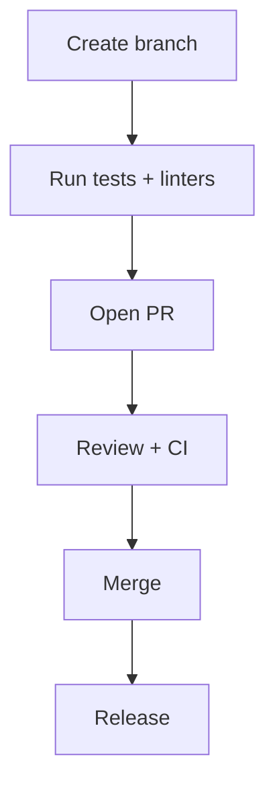

# Contributing

Follow the project's CONTRIBUTING.md, summarized here with quick steps:

1. Fork the repo and create a feature branch:
   git checkout -b feature/your-feature
2. Run linters and tests locally:
   ruff check src/ --fix
   black src/
   pytest
3. Commit with clear messages and open a PR to main
4. CI will run tests and linters; address review comments

Code style:
- Use ruff and black to format code
- Add mypy type annotations where appropriate

Reporting issues:
- Provide steps to reproduce, environment, and logs

Thank you for contributing!

---

## PR workflow (visual)

