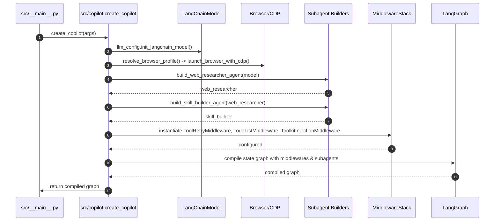

# Graph Execution & Agent Boot (Deep Analysis)

This document analyzes how CIRI constructs and executes the LangGraph-based agent graph at runtime. It references implementation details and exact functions in the codebase so you can trace execution precisely.

Key entrypoints in source:
- create_copilot(...) — src/copilot.py
- CopilotController.run(...) — src/controller.py
- CompiledStateGraph and langgraph astream usage (see src/copilot.py and src/controller.py)

Why this matters
- Understanding the graph compilation and execution model is essential to add new subagents, middlewares, and to reason about streaming behavior, retries, and state management.

High-level boot sequence (detailed)

1. CLI start: `src/__main__.py` calls into `create_copilot()` to build the runtime graph.
2. Model initialization: `llm_config.init_langchain_model()` initializes a LangChain model wrapper.
3. Browser setup (optional): `launch_browser_with_cdp()` may start a browser and provide a CDP endpoint used by crawler/toolkit agents.
4. Subagents built: `build_web_researcher_agent()`, `build_skill_builder_agent()`, `build_toolkit_builder_agent()`, `build_subagent_builder_agent()`, `build_trainer_agent()` — each returns a (compiled) subagent or agent factory that plugs into the graph.
5. Middleware stack assembled: `ToolRetryMiddleware`, `TodoListMiddleware`, `ToolkitInjectionMiddleware`, optional `SkillsMiddleware`, etc.
6. The compiled LangGraph state graph is returned to the CLI which wraps it with `CopilotController` and uses it to run commands and stream updates to the UI.

Mermaid: detailed call flow for create_copilot

Streaming and graph.run

- The graph returns streamed events (messages, updates) via `astream(...)` which `CopilotController.run()` consumes and optionally serializes for the UI.
- Streaming chunks may be of types: `messages` (LLM messages), `updates` (node outputs), and other custom namespaces.

Practical tips
- If you add a middleware or modify subagent builders, add lightweight unit tests that compile the graph and call `controller.get_state()` and `controller.run()` with a mock input to verify stream behavior.
- Use the `serialize=True` option in `CopilotController.run(..., serialize=True)` when writing integration tests that compare snapshot outputs.

Files & functions to review in source
- src/copilot.py: create_copilot()
- src/controller.py: CopilotController.run(), get_state(), get_state_history()
- src/serializers.py: CiriSerializer — how messages and state are serialized for UI and tests
- src/_retry_helpers.py: graphinterrupt_aware_failure — error handling for ToolRetryMiddleware

This page is intentionally technical: keep it close to the code and run small experiments by calling create_copilot() in a unit test to observe graph compilation and stream events.
