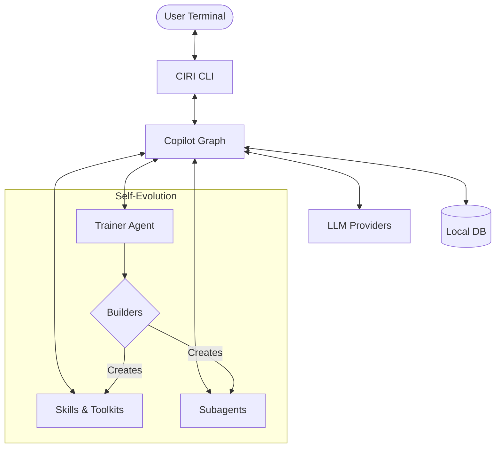

# CIRI Copilot Documentation

Welcome to the official CIRI Copilot documentation. 

**Ciri** is an autonomous, self-evolving AI copilot that lives inside your workspace. Unlike traditional static tools, Ciri can permanently expand its own capabilities by creating new Skills, Toolkits, and SubAgents as it learns about your environment.

## Quick architecture map

Use the sidebar to navigate topics. For code analysis, use `@files:` or `@folders:` followed by the path.

## Helpful Links
- **[Getting Started](getting-started.md)**: Quick installation and first run.
- **[CLI Reference](cli-reference.md)**: Master the slash commands.
- **[Skills Guide](skills-guide.md)**: Learn how to extend Ciri.
- **[Architecture](architecture/overview.md)**: Deep dive into the internals.

