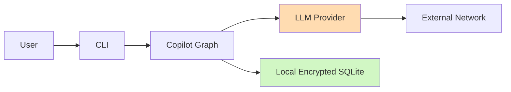

# Security and Privacy

CIRI is designed as a local-first tool. However, using remote models implies sending content to model providers. Security recommendations:

- Use a provider you trust and understand their data retention policy (OpenRouter, OpenAI, etc.)
- Store API keys in the OS keychain or environment variables; avoid committing .env to git
- Use local encrypted SQLite storage for conversation history
- Review third-party dependencies for vulnerabilities; run pip-audit regularly
- Limit filesystem access in toolkits—use allowlists where possible

---

## Data flow & risk model

